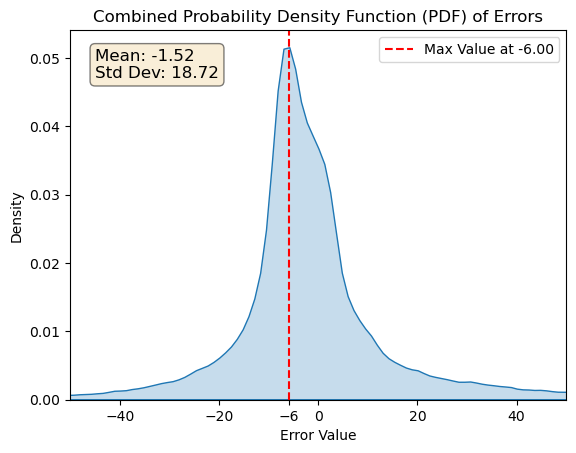
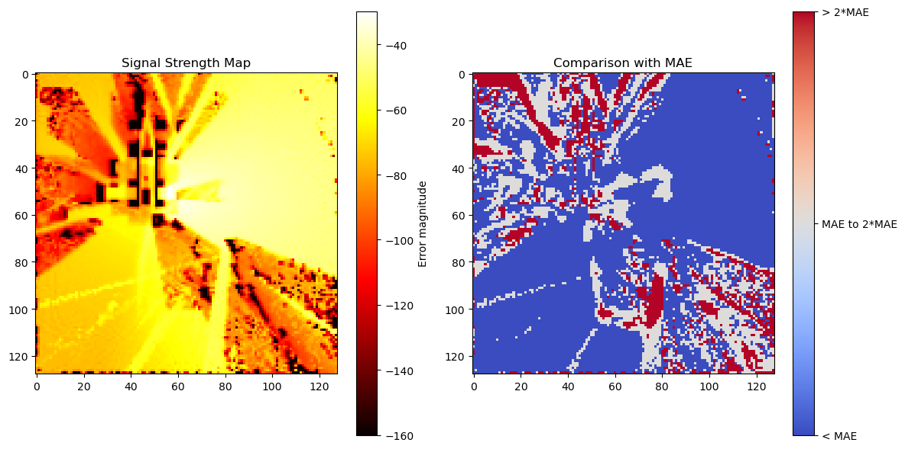
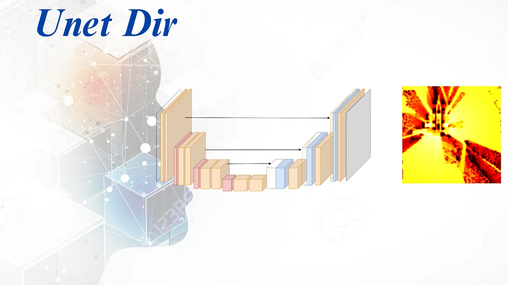

# Communication Projects
These are my projects during college.
- **Group Members**: Fan-Hao Lin, Han-Lin Hung
- **Advisor**: Chao-Kai Wen

## Geo2SigMap

### Introduction
  A deep learning-based signal strength prediction method.
  
  This U-Net model predicts a full signal strength map based on an antenna UMA model, building map, and sparse signal strength data. The first Unet, called Unet-Iso, will predict Path Gain Map based on antenna UMA model and building map. The second Unet, called Unet-Dir will predict Full Signal Strength Map based on the Path Gain Map generated by Unet-Iso, building map and Sparse Signal Strength Map. Unet-Dir can also work by it self, it can fix the prediction based on the sprase signal strength map you provided.

  
  First, use [Blender Blosm](https://github.com/vvoovv/blosm) to download building map form [Open Street Map](https://www.openstreetmap.org/), and then use [Blender mitusba](https://github.com/mitsuba-renderer/mitsuba-blender)
to turn the downloaded map into .xml format.

  Next, compute coverage map using [Sionna](https://nvlabs.github.io/sionna/). For this step, you can refer to [Sionna RT](https://www.youtube.com/watch?v=7xHLDxUaQ7c&t=1s).

  
  Last, compute Full Signal Strength Map using [Link Budget Equation](https://en.wikipedia.org/wiki/Link_budget). For generating training data, you will also need to sample 0 ~ 200 points on full signal strength map to make Sparse Signal Strength Map.

### Result  
We computed PDF of error using our testing data, from the result below, we can see that the PDF has mean = -1.52, and standard deviation = 18.72, quite centeralized at 0.

We also want to know where the prediction error is large, so we test our model on NSYSU campus. From the result, we found that the prediction error will be larger behind buildings and between buildings, expectly between buildings.

### Demo of Unet-Dir 

  
**Reference**: Li et al. (2023), “Geo2SigMap: High-fidelity RF signal mapping using geographic databases,” [Geo2SigMap](https://github.com/functions-lab/geo2sigmap), 2023.

## Geo2ComMap
  A deep learning-based throughput prediction method.

  
  This project functions similarly to Geo2SigMap, predicting a full throughput map based on an antenna UMA model, building map, and sparse throughput data.

  
**Throughput calculation (MIMO Throughput Sim-v3.2)** : We use Matlab code developed by NSYSU Communication Technology Lab (De-Ming Chian, Chao-Kai Wen, Feng-Ji Chen, and Tzu-Hao Huang).
